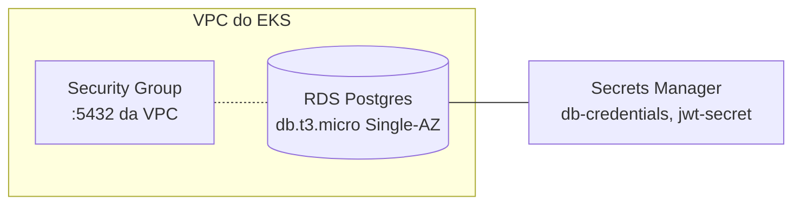

# fiap-fase3-infra-db

> Parte do Tech Challenge FIAP — Pós-graduação Software Architecture (14SOAT) — **Fase 3**.

## Propósito

Provisiona via **Terraform** o banco de dados gerenciado da Fase 3:
- **Amazon RDS Postgres** 16.x (`db.t3.micro`, Single-AZ, gp2 20GB)
- Subnet group reutilizando a VPC criada em [`fiap-fase3-infra-k8s`](https://github.com/arthurfcs98/fiap-fase3-infra-k8s)
- Security group restrito ao CIDR da VPC (acesso só de dentro do EKS / Lambda)
- **AWS Secrets Manager** para credenciais do DB e JWT signing secret

## Arquitetura



## Tecnologias

| Categoria | Stack |
|-----------|-------|
| IaC | Terraform 1.6+ |
| Cloud | AWS (us-east-1) |
| Engine | PostgreSQL 16.x (RDS) |
| Storage | gp2 20GB |
| Secrets | AWS Secrets Manager |
| State | S3 + DynamoDB lock |
| CI/CD | GitHub Actions |

## Setup local

> ⚠️ Em construção. Ver [plano 06](../plans/fase-3/06-infra-rds.md).

```bash
export AWS_PROFILE=fiap

cd terraform
terraform init
terraform plan
terraform apply
```

## Outputs (state remoto)

- `db_endpoint`
- `db_port`
- `db_secret_arn`
- `jwt_secret_arn`
- `db_security_group_id`

## Justificativa do banco

PostgreSQL — continuidade do modelo da Fase 2, com features avançadas (UUID nativo, enum, CHECK, jsonb, CTEs). Detalhe completo em [RFC-03 do repo `fiap-fase3-app`](https://github.com/arthurfcs98/fiap-fase3-app/blob/main/docs/rfcs/RFC-03-database-choice.md).

## Restrições do AWS Academy

- Engines suportados: Aurora, Oracle, SQL Server, MySQL, PostgreSQL, MariaDB
- Instance: até `medium` Burstable
- Storage: até 100GB gp2 (gp3 não suportado)
- Sem Enhanced Monitoring

## Repositórios da Fase 3

- [`fiap-fase3-app`](https://github.com/arthurfcs98/fiap-fase3-app) — API principal (docs centrais)
- [`fiap-fase3-auth-lambda`](https://github.com/arthurfcs98/fiap-fase3-auth-lambda) — Lambda auth
- [`fiap-fase3-infra-k8s`](https://github.com/arthurfcs98/fiap-fase3-infra-k8s) — EKS Terraform
- [`fiap-fase3-infra-db`](https://github.com/arthurfcs98/fiap-fase3-infra-db) ← você está aqui

## Autor

Arthur Freitas Cesarino dos Santos — RM369347
