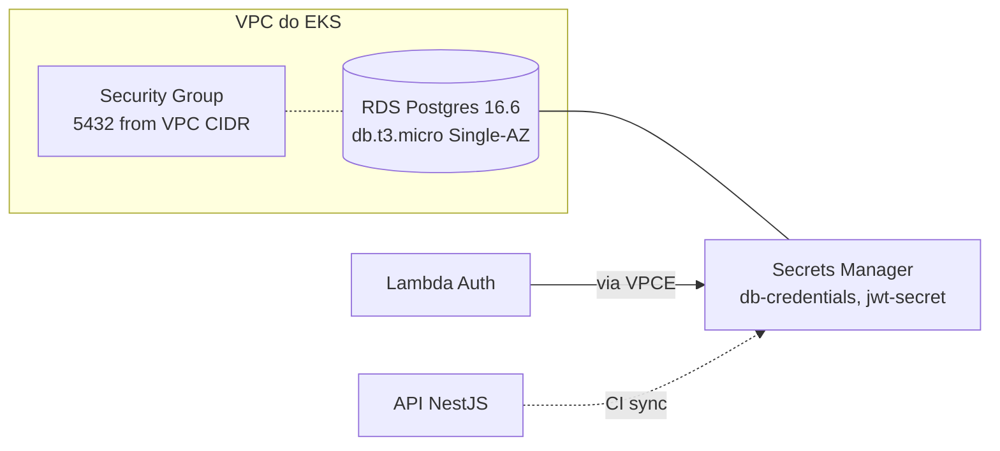

# fiap-fase3-infra-db

> **Tech Challenge FIAP — Pós-graduação Software Architecture (14SOAT) — Fase 3**

Provisiona via **Terraform** o banco de dados gerenciado da Fase 3.

[](https://github.com/arthurfcs98/fiap-fase3-infra-db/actions/workflows/terraform.yml)

## O que provisiona

- **Amazon RDS Postgres 16.6** — `db.t3.micro`, Single-AZ, gp2 20GB, encryption-at-rest
- **DB Subnet Group** reutilizando subnets da VPC do `infra-k8s`
- **Security Group** que aceita Postgres 5432 da VPC inteira (EKS pods + Lambda)
- **AWS Secrets Manager** — 2 secrets:
  - `fiap-fase3-db-credentials` — JSON `{host, port, username, password, dbname}`
  - `fiap-fase3-jwt-secret` — HS256 signing key compartilhada entre Lambda Auth, Authorizer e API
- **Senhas geradas** via `random_password` (24 chars sem especiais para o DB; 48 chars para JWT)

## Arquitetura



## Stack

| Categoria | Tech |
|-----------|------|
| IaC | Terraform 1.6+ |
| Cloud | AWS (us-east-1) |
| Engine | PostgreSQL 16.6 (RDS gerenciado) |
| Storage | gp2 20GB (criptografado) |
| Secrets | AWS Secrets Manager |
| Random | Terraform `random_password` |
| State | S3 + DynamoDB lock |

## Estrutura

```
fiap-fase3-infra-db/
├── terraform/
│   ├── backend.tf            # S3 backend
│   ├── providers.tf          # aws + random
│   ├── versions.tf
│   ├── variables.tf
│   ├── outputs.tf            # endpoint, port, secret ARNs, SG id
│   ├── main.tf               # VPC subnet group + SG + RDS instance
│   └── secrets.tf            # random_password + Secrets Manager
├── envs/
│   ├── homolog/terraform.tfvars
│   └── prod/terraform.tfvars
└── .github/workflows/
    └── terraform.yml         # plan em PR; apply em main/homolog
```

## Outputs (consumidos por outros repos)

- `db_endpoint` — `<id>.<region>.rds.amazonaws.com:5432`
- `db_address`, `db_port`, `db_name`
- `db_secret_arn` — consumido por Lambda Auth + API NestJS (via CI sync)
- `jwt_secret_arn` — consumido por Lambda Auth, Lambda Authorizer, API NestJS
- `db_security_group_id`

## Setup local

```bash
export AWS_PROFILE=fiap

cd terraform
terraform init
terraform plan -var-file=../envs/homolog/terraform.tfvars
terraform apply -var-file=../envs/homolog/terraform.tfvars
```

RDS demora ~5-8min pra ficar `available`. Depois, secrets aparecem em `aws secretsmanager list-secrets`.

## Justificativa do banco

PostgreSQL — continuidade do modelo da Fase 2, com features avançadas (UUID nativo, enum tipado, CHECK constraints, JSONB, CTEs, window functions). Detalhe formal em [RFC-03 do repo `fiap-fase3-app`](https://github.com/arthurfcs98/fiap-fase3-app/blob/main/docs/rfcs/RFC-03-database-choice.md) (inclui diagrama ER e modelo de dados).

## Decisões de modo blitz

- `skip_final_snapshot = true` — recriação rápida via Terraform
- `backup_retention_period = 0` — sem backups (escopo de demo)
- `recovery_window_in_days = 0` (secrets) — delete imediato no destroy
- Enhanced Monitoring + Performance Insights desabilitados (Academy não suporta)
- Single-AZ Burstable (cabe no orçamento)
- Engine version 16.6 (16.3 não disponível no Academy)

## Restrições do AWS Academy aplicadas

- Engine Postgres OK; versões `16.6, 16.8, ..., 16.14` listadas
- Storage até 100GB gp2 (não gp3)
- Sem Enhanced Monitoring nem Performance Insights
- `iam:CreateRole` bloqueado — não pode criar monitoring role

## Repositórios da Fase 3

- [fiap-fase3-app](https://github.com/arthurfcs98/fiap-fase3-app) — API principal + docs
- [fiap-fase3-auth-lambda](https://github.com/arthurfcs98/fiap-fase3-auth-lambda) — Lambda auth
- [fiap-fase3-infra-k8s](https://github.com/arthurfcs98/fiap-fase3-infra-k8s) — EKS
- **[fiap-fase3-infra-db](https://github.com/arthurfcs98/fiap-fase3-infra-db)** (este)

## Autor

Arthur Freitas Cesarino dos Santos — RM369347
